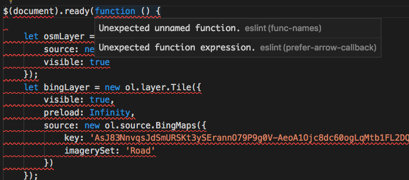

ESLint: The Strict Code Reviewer Living in My VSCode
When people hear the term "coding standards," the first thing that usually comes to mind is the endless, often petty debate: spaces or tabs? Where does the curly brace go? For a long time, I viewed these rules as just cosmetic preferences. As long as the code compiles and the program runs, who cares if the indentation is a bit messy?

However, after spending the past week wrestling with ESLint in VSCode while setting up my professional portfolio website, my perspective has completely shifted. I'm starting to realize that coding standards aren't just about making your code look pretty for the next person who reads it; they are actually a real-time learning tool.

The Initial Pain: A Sea of Red Squiggly Lines
Let’s be honest: my first impression of using ESLint was pure frustration.

When I first fired up VSCode with the ESLint extension fully configured for my project, my files lit up like a Christmas tree. There were red and yellow squiggly lines everywhere.

[ screenshot ]

  
   
  <em>(Caption: A familiar sight during my first few days with ESLint.)</em>

Every time I saved a file, a new error would pop up. Missing semicolon. Trailing whitespace. Expected '=' and instead saw ''. It felt like having an overly strict grammar teacher standing right behind my chair, pointing out every single typo before I even had the chance to finish my thought. Getting rid of all those errors felt incredibly tedious. I found myself spending more time satisfying the linter than actually writing the logic for my webpage.

The Shift: From Annoying to Useful
But after a few days of this "trial by fire," something clicked. The pain started to transform into usefulness.

I noticed that ESLint wasn't just nagging me about formatting; it was catching actual logic flaws before I even ran the code in the browser. For example, by strictly enforcing rules against unused variables or implicitly declared globals, ESLint saved me from debugging sessions that would have otherwise taken hours.

// ESLint taught me to avoid careless mistakes like this:
let userCount = 10;
usercount = 11; // ESLint catches this typo immediately!

I started to agree with the idea that coding standards help you learn a language. JavaScript can be famously forgiving—sometimes too forgiving. It lets you get away with sloppy practices that will eventually break your application. ESLint acts as a guardrail. By forcing me to write code that adheres to a strict standard, it's essentially training my muscle memory to write cleaner, more secure, and more efficient JavaScript from the start.

The Takeaway
So, is getting rid of ESLint errors painful or useful? It is absolutely both.

It's painful in the same way going to the gym is painful. The initial setup and the constant corrections slow you down at first. But the long-term payoff is undeniable. Writing clean code is no longer an afterthought that I have to fix right before pushing to GitHub; it’s becoming a built-in part of my development process.

I might still get annoyed when ESLint yells at me for a missing space inside a bracket, but I’ve learned to trust the red squiggly lines. They are making me a better software engineer.

Note: I utilized generative AI (Gemini) strictly as an outlining and proofreading assistant to help structure my thoughts and refine the grammar of this essay, ensuring my personal reflections were communicated clearly.
