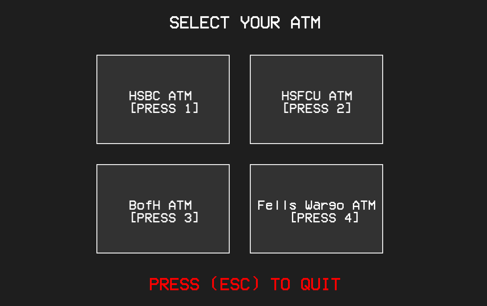

This project is an interactive, multi-bank ATM simulator developed in C++ using the SFML framework to deliver an event-driven graphical user interface and integrated audio feedback. Architected around a centralized Finite State Machine (FSM), the application efficiently manages real-time user input and visual rendering to guide users through a multi-tiered banking pipeline, including ATM network selection, credential validation, and live account management.

On the backend, the system leverages Object-Oriented Programming (OOP) and STL containers to enforce rigorous business logic and defensive security measures. Key accomplishments include implementing a secure PIN verification system with real-time character masking and a three-strike fraud-prevention lockout policy. Additionally, the transaction engine handles complex financial compliance, validating withdrawal inputs (multiples of $20), executing overdraft protection, and dynamically calculating cross-bank processing fees—including a ceiling-capped 2% algorithm—based on the user's account institution.

