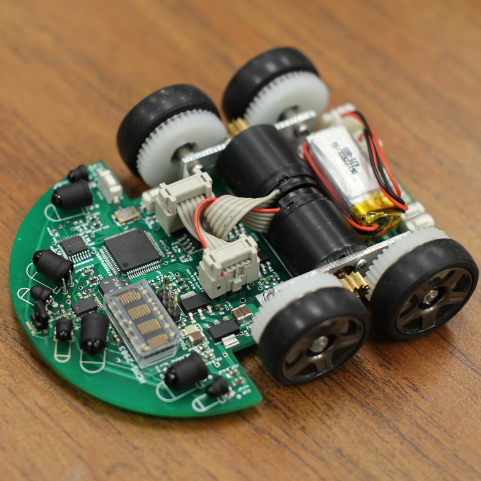

  
  
  

While a microcontroller handles low-level motor functions, the rover's autonomy is driven by a Raspberry Pi, where I engineered the core target detection software. The vision program runs in a dedicated thread parallel to the rover's search logic, continuously analyzing live PiCam frames.

Using color-segmentation, the system isolates purple targets and extracts centroid and radius data to guarantee high detection confidence. Once a target is verified, this event instantly overrides the sweep behavior and issues a real-time, full-stop command to the underlying hardware.
